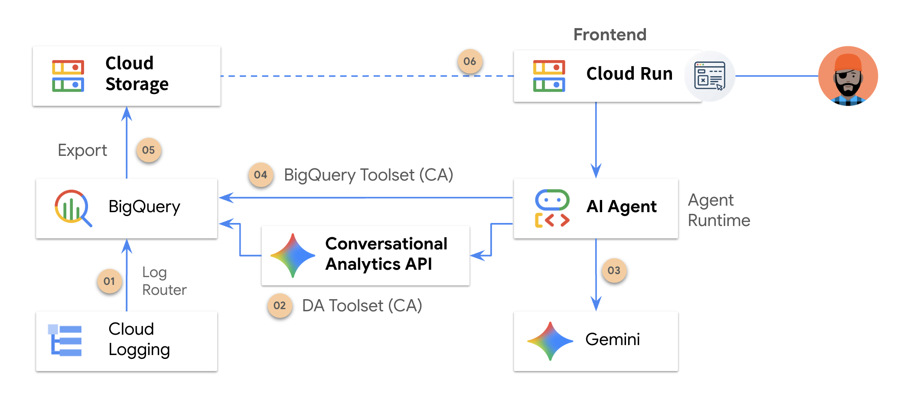

# GKE Log Analysis AI Agent

BigQuery 에 수집되는 GKE 로그를 대상으로, 로그 분석 및 문제 해결을 지원하는 AI 에이전트입니다. Conversational Analytics API 기반의 커스텀 도구 및 BigQuery 통합을 활용하여 자연어 질의를 SQL로 변환하고 시스템 에러를 분석하여 SRE 전문가 수준의 가이드를 제공합니다.



---

## 🚀 Agent Runtime 배포를 위한 기본 설정

### 1. 환경 변수 및 관련 API 활성화
배포에 사용할 Google Cloud Project ID를 설정하고 필수 API들을 활성화한 후, 배포 관련 환경 변수를 정의합니다.

```bash
cd ~/workspace/agent/gke_log_analysis
```

```bash
gcloud services enable \
    aiplatform.googleapis.com \
    logging.googleapis.com \
    cloudtrace.googleapis.com \
    storage.googleapis.com \
    bigquery.googleapis.com \
    iam.googleapis.com
```

```bash
export PROJECT_ID="YOUR_PROJECT_ID"
export LOCATION="us-central1"
export STAGING_BUCKET_URI="gs://adk-${PROJECT_ID}"
export SERVICE_ACCOUNT="sa-gke-log-analysis"

# Cloud Logging 이 수집되고 있는 BigQuery 의 Dataset ID
export BQ_DATASET_ID="YOUR_BIGQUERY_DATASET_ID" 
```

### 2. Cloud Storage 버킷 생성
배포 산출물을 저장할 Google Cloud Storage 버킷을 생성합니다. (이미 사용 중인 버킷이 있다면 이 단계는 건너뛰셔도 됩니다.)

```bash
gcloud storage buckets create ${STAGING_BUCKET_URI} --location=${LOCATION}
```

### 3. 서비스 계정 생성 및 권한 설정
```bash
# 서비스 계정 이메일 주소 정의 (자동 매칭)
export SA_EMAIL="${SERVICE_ACCOUNT}@${PROJECT_ID}.iam.gserviceaccount.com"

# 서비스 계정 생성
gcloud iam service-accounts create ${SERVICE_ACCOUNT} \
    --description="Service account for GKE Log Analysis deployment" \
    --display-name="gke-log-analysis-sa"

# 필요한 IAM 역할 목록
ROLES=(
    "roles/cloudtrace.user"
    "roles/cloudtrace.agent"
    "roles/logging.viewer"
    "roles/logging.logWriter"
    "roles/storage.objectAdmin"
    "roles/aiplatform.user"    
    "roles/bigquery.user"
    "roles/bigquery.dataViewer"
)

# 반복문을 통해 권한 일괄 부여
for ROLE in "${ROLES[@]}"; do
    gcloud projects add-iam-policy-binding ${PROJECT_ID} \
        --member="serviceAccount:${SA_EMAIL}" \
        --role="${ROLE}"
done
```

### 4. `.env` 파일 생성 및 환경 변수 설정
환경 변수 템플릿(`.env.template`)을 참조하여 프로젝트 정보를 치환한 로컬 `.env` 파일을 생성하고, 배포에 사용할 변수들을 안전하게 등록합니다.

```bash
# 환경 변수 템플릿을 치환하여 로컬 .env 생성 (gke_log_analysis 디렉토리 내부에서 실행)
sed -e "s|YOUR_GOOGLE_CLOUD_PROJECT_ID|${PROJECT_ID}|g" \
    -e "s|YOUR_GCP_RESOURCE_LOCATION|${LOCATION}|g" \
    -e "s|YOUR_BUCKET_URI|${STAGING_BUCKET_URI}|g" \
    -e "s|YOUR_SA_EMAIL|${SA_EMAIL}|g" \
    -e "s|YOUR_BIGQUERY_DATASET_ID|${BQ_DATASET_ID}|g" \
    .env.template > .env

# 최종 설정이 정상적으로 반영되었는지 확인
cat .env
```

---

## 🚀 Agent Runtime 배포

아래의 명령어를 실행하여 에이전트를 Vertex AI Agent Runtime에 성공적으로 배포합니다.
```bash
uv run python agent_runtime.py
```

```bash
export AGENT_RUNTIME_ID=
echo "AGENT_RUNTIME_ID=${AGENT_RUNTIME_ID}" >> .env
```

## 🚀 Frontend 배포

프론트엔드 Gradio 애플리케이션은 **독립된 경량 컨테이너 아키텍처**로 설계되어 있습니다. 배포 스크립트를 실행하여 Cloud Run에 신속히 배포합니다.

```bash
# 프론트엔드 단독 배포
./frontend/deploy_cloud_run.sh
```

> [!NOTE]
> 프론트엔드 배포는 `frontend/Dockerfile`과 `frontend/requirements.txt`를 기반으로 동작하여, 빌드 시 오직 프론트엔드 폴더(`frontend/`)만 도커 컨텍스트로 업로드하기 때문에 전송 및 컨테이너 빌드가 매우 신속하게 처리됩니다.

---

## 🔍 Agent Runtime 테스트 (REST API)

배포 완료 후 반환받은 `AGENT_RUNTIME_ID`를 이용하여 에이전트와 대화를 시작하고 동작을 직접 검증합니다.

### 1. 세션 생성
새로운 세션을 생성하여 대화를 준비합니다.
```bash
export AGENT_RUNTIME_ID="[배포 후 발급받은 AGENT_RUNTIME_ID]"
export PROJECT_NUMBER=$(gcloud projects describe ${PROJECT_ID} --format="value(projectNumber)")

curl -X POST \
  -H "Authorization: Bearer $(gcloud auth print-access-token)" \
  -H "Content-Type: application/json" \
  https://${LOCATION}-aiplatform.googleapis.com/v1beta1/projects/${PROJECT_NUMBER}/locations/${LOCATION}/reasoningEngines/${AGENT_RUNTIME_ID}:query \
  -d '{
    "class_method": "create_session",
    "input": {
      "user_id": "test_user"
    }
  }'
```

### 2. 쿼리 실행 (대화 테스트)
세션 생성 성공 시 전달받은 `SESSION_ID`를 등록하여 GKE 로그 분석을 위한 질문을 에이전트에게 던져봅니다.
```bash
export SESSION_ID="[위 단계에서 발급받은 SESSION_ID]"
export MESSAGE="최근 발생한 GKE 에러 로그 5개를 분석하고 원인을 알려줘."

curl -s -X POST \
  -H "Authorization: Bearer $(gcloud auth print-access-token)" \
  -H "Content-Type: application/json" \
  https://${LOCATION}-aiplatform.googleapis.com/v1beta1/projects/${PROJECT_NUMBER}/locations/${LOCATION}/reasoningEngines/${AGENT_RUNTIME_ID}:streamQuery \
  -d '{
    "class_method": "async_stream_query",
    "input": {
      "user_id": "test_user",
      "session_id": "'"${SESSION_ID}"'",
      "message": "'"${MESSAGE}"'"
    }
  }' | jq '.'
```

---

## 🧪 로컬 테스트 및 동작 검증 (Local Testing)

배포 전에 로컬 환경 가상환경(`.venv`) 내에서 API 연동성 및 커스텀 분석 도구의 정밀 출력 결과를 신속히 검사할 수 있도록 유틸리티 스크립트를 제공합니다.

### 1. Conversational Analytics 기본 연동 검증
특정 질문에 대한 원격 Conversational Analytics API의 가상 쿼리 동작과 데이터 수집 여부를 단독 검증합니다.
```bash
uv run python test_ca_client.py "어제 발생했던 에러 로그의 원인이 뭐야?"
```